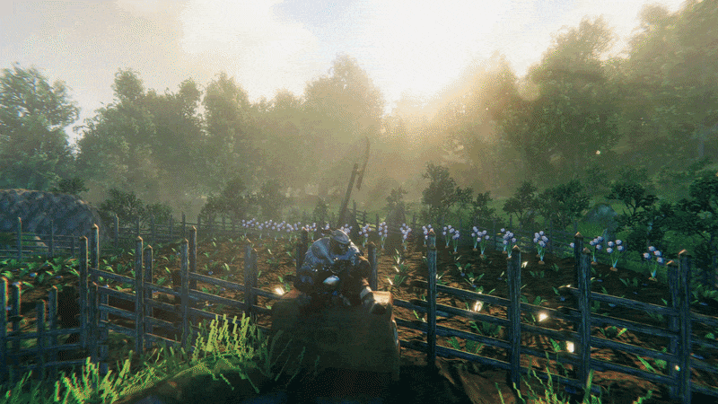
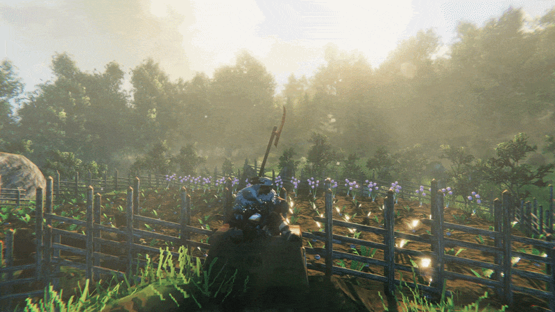
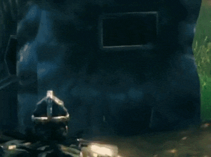
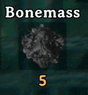

# iHUD - Immersive HUD

**HUD when you need it, HIDE when you don't.**

iHUD is a [BepInEx](https://github.com/BepInEx/BepInEx) mod for Valheim that hides HUD elements when they aren't needed and shows them again when they are. Inspired by the Skyrim mod [Immersive HUD](https://www.nexusmods.com/skyrimspecialedition/mods/12440).

[Nexus Mods page](https://www.nexusmods.com/valheim/mods/3867)



## Features

- Automatic showing and hiding of:
  - Crosshair
  - Health bar
  - Food bar
  - Status effects
  - Hotbar
  - Forsaken (guardian) powers
  - Ship HUD (sail setting icon)
- Combat module: keep chosen elements visible while enemies are hunting you
- Mod UI linking: attach HUD elements added by other mods to iHUD modules
- Hotkeys to toggle the whole mod and the minimap
- Full controller support, with hot-swapping between controller and keyboard
- Everything is configurable: delays, fade times, popup thresholds, and every module can be switched off individually

> **Note:** All UI elements are shown while the inventory is open. This can be turned off with `Show All On Inventory`.

## Behavior

### Hotbar

Shown when you swap equipped items (hotbar keys, controller selection or equipping something). Can be set to always hidden with `Mode = AlwaysHidden` in the `Hotkey Bar` section.



### Crosshair

Hidden unless you are looking at something interactable or using a ranged weapon (bows, crossbows, spear throws).



### Health

Hidden while at full health. Shown when you take damage, then fades out.


### Food

Hidden until a food gets close to running out, or a food has expired recently (within 60 s by default). "Close to running out" can be a number of seconds or a percentage of the food's duration (50% by default). The bar can also pop up at specific intervals through `Popup Mode`.


### Forsaken powers

Hidden unless you swap to a different power, press the activate-power key, a power comes off cooldown, or there is less than a minute left on the cooldown. Also pops up at 10 and 5 minutes remaining.



### Minimap

Toggled with a hotkey (default `B`). The state is saved between sessions.


### Status effects

- Infinite effects are shown when gained, then hidden after a delay (5 s by default).
- Effects with a duration (poison, burning, Rested, mead buffs) are shown when gained and again when under 60 s remain.
- Effects longer than a minute briefly reappear at 20, 15, 10 and 5 minutes left (configurable).
- Resting reappears whenever your comfort level changes.


### Ship HUD

The oar / half sail / full sail icon under the minimap shows when you take the helm or change speed, then fades. Can be hidden entirely. The speed arrows can optionally fade too (`Speed Indicator Handling`).

### Combat (off by default)

While an enemy is targeting you, the modules you pick stay visible, then fade out when combat ends. Enable it with `Combat Handling` in the `Modules` section.

- `Detection Mode`: `Aggroed` (enemy has spotted you, red icon) or `Alerted` (enemy has noticed you, yellow icon)
- `Show Mode`: `WhileInCombat` or `FixedDuration`
- `Included Modules`: any of `Health, Food, StatusEffects, Crosshair, Hotbar, GuardianPower, ShipHud`

### Mod UI linking (off by default)

Set `Link Mod UIs` to `true` and iHUD finds HUD elements added by other mods and lists them under `3. Mod Linking` in the config. By default they are hidden while iHUD is enabled. Give each one a comma-separated list of iHUD modules (for example `Health, Combat`) and it will show and hide together with them.

### Hide damage numbers (off by default)

`Hide Damage Numbers` hides the floating damage, healing and block numbers while iHUD is enabled.

## Default controls

| Action | Keyboard | Controller |
| --- | --- | --- |
| Toggle iHUD on/off | `H` | `LB` + `D-Pad Left` |
| Toggle minimap | `B` | `LB` + `D-Pad Right` |

Hotkeys are ignored while you are typing in chat, the console, sign text or a map pin name.

## Installation

### Vortex

1. Install [Vortex](https://www.nexusmods.com/vortex).
2. On the [mod page](https://www.nexusmods.com/valheim/mods/3867), go to **Files** and click **Mod manager download**.

### r2modman / Thunderstore

1. Download the mod manually from the Nexus **Files** tab.
2. In r2modman, open **Settings > Profile > Import local mod** and select the downloaded `.zip`.

### Manual

1. Install the latest x64 Windows version of [BepInEx](https://github.com/BepInEx/BepInEx/releases) ([Nexus](https://www.nexusmods.com/valheim/mods/3605) works too).
2. Download iHUD, extract it, and copy `iHUD.dll` into `Valheim/BepInEx/plugins/`.

## Configuration

Run the game once with the mod installed, then edit:

```
Valheim/BepInEx/config/iHUD.cfg
```

Every setting has a description and its accepted values in the file. You can also use an in-game config menu mod such as [Mod Configs](https://www.nexusmods.com/valheim/mods/3491). Some settings need a game restart to apply.

Examples:

**Turn off a module** (the element goes back to vanilla behaviour):

```ini
[2. Modules]
Status Effect Handling = false
```

**Change hotkeys:**

```ini
[1. General]
Toggle HUD Hotkey = X
Minimap Toggle Hotkey = V
```

**Change controller buttons** (use `None` to disable):

```ini
[1. General]
Gamepad Toggle Modifier = BumperL
Gamepad Toggle Button = DPadLeft
Gamepad Minimap Modifier = BumperL
Gamepad Minimap Button = DPadRight
```

Valid button names: `BumperL, BumperR, TriggerL, TriggerR, StickL, StickR, DPadLeft, DPadRight, DPadUp, DPadDown, ButtonNorth (Y), ButtonSouth (A), ButtonWest (X), ButtonEast (B), Start, Select`.

## Compatibility

iHUD only changes the alpha of vanilla HUD elements, so mods that purely change visuals such as layout, scale, colours or positions should work (Minimal UI, MyLittleUI and BetterUI look like they fall in that group, but they are untested).

- If another mod hides or fades the same element, turn off the matching module in iHUD's config.
- Mods that restructure vanilla HUD elements may cause trouble.
- HUD elements added by other mods are left alone unless you enable `Link Mod UIs`.

Built and tested on Valheim 1.0.15 (n-40). Also tested on 0.221.12. If you find an incompatibility, please open an issue with your mod list.

## Building

The project is a single BepInEx plugin (`iHUD.cs`). To build it you need references to:

- `BepInEx.dll` and `0Harmony.dll`
- Valheim's `assembly_valheim.dll`, `assembly_utils.dll`
- The Unity assemblies the game ships (`UnityEngine`, `UnityEngine.CoreModule`, `UnityEngine.UI`, `UnityEngine.InputLegacyModule`, and so on)

Gamepad and Input System keyboard support is done through reflection, so there is no compile-time reference to `Unity.InputSystem.dll`.

## Changelog

See the [Nexus changelog](https://www.nexusmods.com/valheim/mods/3867?tab=description) for the full version history.

## Credits

- [Gopher](https://www.nexusmods.com/profile/Gopher) / [Goldenrevolver](https://www.nexusmods.com/profile/Goldenrevolver), creator of the original [Immersive HUD](https://www.nexusmods.com/skyrimspecialedition/mods/12440), for the idea
- The BepInEx and Harmony developers
- Iron Gate for making this amazing game
